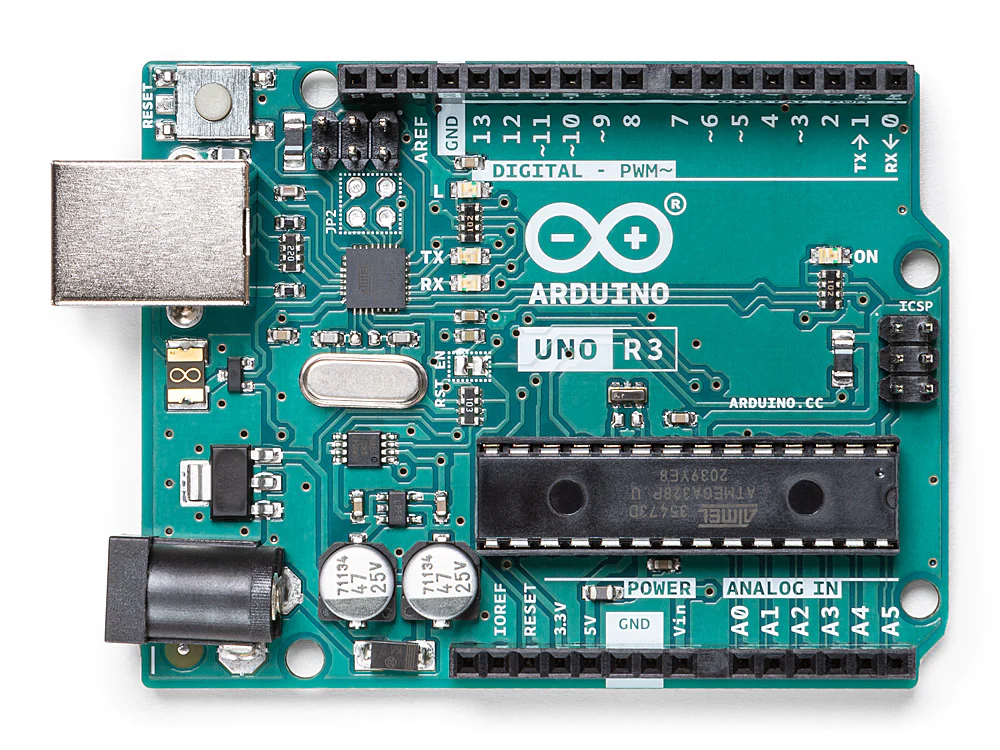

# 单片机多任务调度
## 简介
目的是为了研究单核心CPU的多任务调度机制和时间片轮转法。该项目是一个学习类项目，不具备工程参考价值。

## 硬件
基于Arduino UNO开发板。

## 构建
```sh
pio run -e uno -t upload --upload-port COM7
```
## 实验记录
### 预设期望
1. 开启两个任务，任务A运行期间 sleep 1000豪秒; 任务B运行期间 sleep 10豪秒；
2. CPU频率为每 5秒 一次调度，这里是为了观察运行效果，可以调整的更慢一些；
3. 中断为 5 毫秒一次
### 断言预测
当A任务执行的时候，会触发CPU调度机制，会在第五秒的时候将其挂起，然后切换到B，B在第15毫秒的时候会被挂起，然后切换到A

## 设计思路
1. 用户程序控制自己的让出时机
    ```c
    void task(id){
        if (gettask(id).state != RUNNING){
            task_yield()
        }
        user_code();
    }
    ```
2. CPU中断来控制让出时机
   ```c
   ISR(){
        setjmp(stack)
        longjmp(next_stack)
   }
   ```